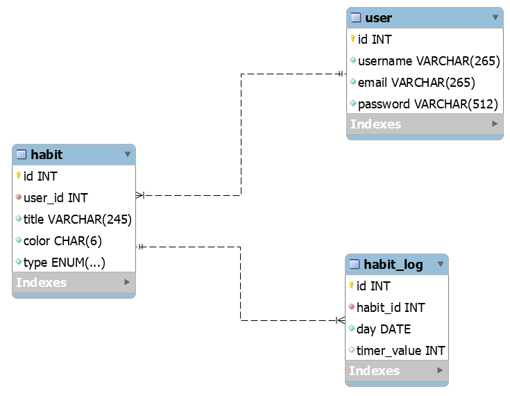
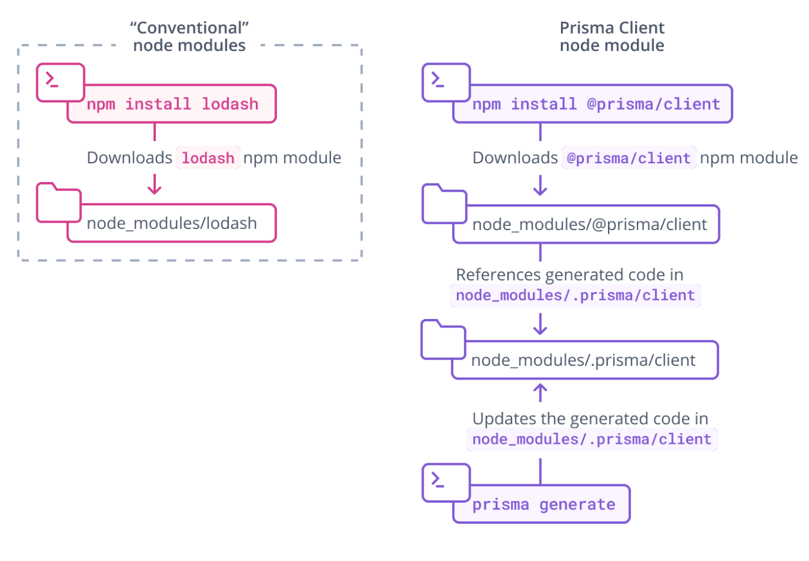
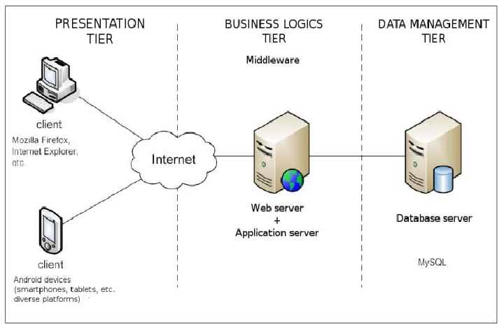

# HeatMaps

The HeatMaps application is a habit tracker system to help one develop a life of discipline.

Inspired by `lifeofdiscipline.com`, the goal is to have a similar system without the limitations imposed by their unpayd subscription.

> **This is the repository for the backend-api and database development.**

# Database Design

This is the database for the habits tracker app:



## Initialize database for development

Run the docker container:

```sh
$ docker run -p 3306:3306 --name heatmaps-db --env MYSQL_ROOT_PASSWORD=123456 --detach mysql:8.0
```

If the container stops afterwards you can just restart it:

```sh
$ docker restart heatmaps-db
```

## Initialize project for development

1. Set the system env variables (or the `.env` file) with [the necessary information][5].

2. Sync the database schema:

```sh
$ npx prisma migrate reset
```

3. Install the application dependencies:

```sh
$ npm install
```

4. Start the development:

```sh
$ npm run start:dev
```

## Object Relational Mapping

This project uses Prisma ORM and the database client interface is generated based on the file `prisma/schema.prisma`.



To fix schema drift in the development environment [check this link][3].

### Database changes

To change the database schema, first alter the file ./prisma/schema.prisma. Then execute the prisma cli to sync the database changes:

```
$ npx prisma migrate dev --name migration_name
```

After database modifications, it's necessary to update the prisma client:

```sh
$ npx prisma generate
```

# System Architecture 

A simple three tier architecture is proposed to develop the solution.



# Code Architecture

To be able to accommodate a source code base that may grow big as time passes, a layered implementation with well-defined responsibilities should be used:

- *./src/controllers* - delegates the request to the appropriate underlying system.
- *./src/services* - custom business related processing and rules (optional).
- *./src/repositories* - database entities interaction.

The creation and naming of the elements above should always attempt to mimic the application model and entities. The application model is composed by the Entities defined in the system, such as `Users`, `Habits` and `HabitLogs`. For example, we could imagine a user-controller, user-service and user-repository.

For code and definitions that are highly generic and that are not necessarily attached to any application model or entities, we should define them in the `lib` layer:

- *./src/lib* - shared and reusable code.

## Use relative imports

The creator of the Nest.js [suggests][1] that using the absolute paths is a bad practice. Also, the TypeScript's official documentation [recommends][2] using relative paths for our own modules. 

Configure VS Code to import using relative paths by default

`"typescript.preferences.importModuleSpecifier": "relative"`

## Example of generating new resources

To create a new controller run:
```bash
$ nest g controller controllers/user --flat
```

To create a new service run:
```bash
$ nest g service services/user --flat
```

To create a new repository run:
```bash
$ nest g provider repositories/user --flat
```

---

[1]: https://github.com/nestjs/typeorm/issues/321#issuecomment-588678297
[2]: https://www.typescriptlang.org/docs/handbook/module-resolution.html#relative-vs-non-relative-module-imports
[3]: https://www.prisma.io/docs/guides/database/developing-with-prisma-migrate/troubleshooting-development#fixing-schema-drift-in-a-development-environment
[4]: https://docs.nestjs.com/security/authentication
[5]: https://gist.github.com/allisonmachado/4ffe26d65e689dce9d63dcaca4391ad8