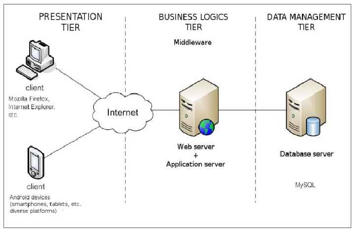

# HeatMaps

The HeatMaps application is a habit tracker system to help one develop a life of discipline.

Inspired by lifeofdiscipline.com, the goal is to have a similar system without the limitations imposed by their unpayd subscription.

> **This is the repository for the backend-api and database development.**

# Database Design

This is the database for the habits tracker app:


## Initializing a temporary MySQL instance from the logical backup

Change into the `/databases` directory and build the Docker image:

```sh
docker build . --tag heatmaps
```

Run the database container:

```sh
docker run  -d  -p 3306:3306  --name heatmaps-db-container  heatmaps
```

# System Architecture 

A simple three tier architecture is proposed to develop the solution.



# Source Code Architecture

To be able to accommodate a source code base that may grow big as time passes, a layered implementation with well-defined responsibilities should be used:

- *./src/controllers* - delegates the request to the appropriate underlying system.
- *./src/services* - custom business related processing and rules (optional).
- *./src/repositories* - database entities interaction.
- *./src/lib* - shared and reusable code.

The creation and naming of those elements should always attempt to mimic the application Model. The application model is composed by the Entities defined in the system, such as `Users`, `Habits` and `HabitLogs`. For example, we could imagine a user-controller, user-service and user-repository.

# System Design

## List a user habits

> listUserHabits(user);

Parameters:
- user: The logged user for which the habits should be retrieved

This api queries the `habit` table and returns all the habits for the given user.

## Create a user habit

> createUserHabit(user, title, color, type);

Parameters:
- user: The logged user for which the habits should be retrieved
- title: The title string for the habit
- color: The hex value for the habit displayed color

The record is inserted into the `habit` table.

## Update a user habit

> updateUserHabit(user, habit, title, color);

Parameters:
- user: The logged user for which the habits should be retrieved
- habit: The habit that should be updated
- title: The title string for the habit
- color: The hex value for the habit displayed color

The record is updated into the `habit` table.

The habit type should not be altered after it's creation.

## Delete a user habit

> deleteUserHabit(user, habit);

Parameters:
- user: The logged user for which the habits should be retrieved
- habit: The habit that should be deleted

This is a hard delete.

The logs related to this habit should be deleted in a cascade fashion.

This api deletes records in the `habit` and `habit_log` table.

## List a user habit log

> listUserHabitLog(user, habit, startDate, endDate);

Parameters:
- user: The logged user for which the logs should be retrieved
- habit: The habit for which the logs should be retrieved
- startDate: The date for the minimum habit log, defaults to one year behind today.
- startDate: The date for the maximum habit log, defaults to today.

This interface queries the `habit_log` table and returns all the logs for the given user and habit that are in the time range passed.

## Register a user habit log

> logUserHabit(user, habit, date, value);

Parameters:
- user: The logged user for which the logs should be retrieved
- habit: The habit for which the logs should be retrieved
- date: The date in which the user is practicing the habit
- value: The value to be tracked
    - The value data type can vary depending on the habit

The logs are saved in the `habit_log` table.

Important validation:
- Check if the habit belongs to the user
- Check if the payload type correspond to the habit type
