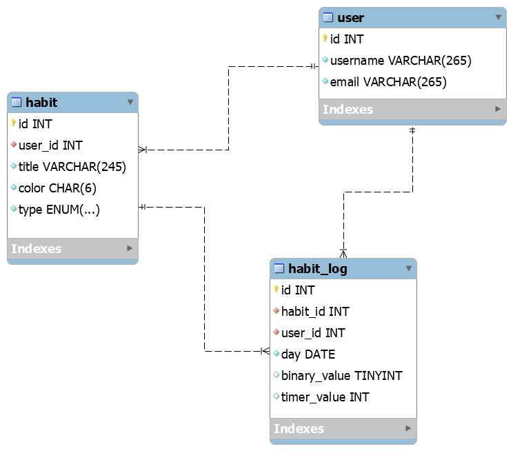

# HeatMaps

The HeatMaps application is a habit tracker system to help one develop a life of discipline.

Inspired by lifeofdiscipline.com, the goal is to have a similar system without the limitations imposed by their unpayd subscription.

# Database

This is the database for the habits tracker app:



## Initializing a temporary MySQL instance from the logical backup

Change into the databases directory and build the Docker image:

```sh
docker build . --tag heatmaps
```

Run the database container:

```sh
docker run
  --rm
  -d
  -p 3306:3306
  --name heatmaps-container
  heatmaps
```
